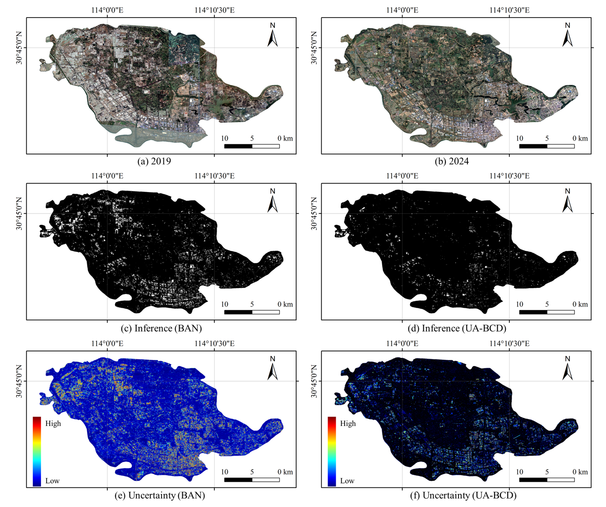

# UA-BCD

The official implementation of **"Overcoming the Uncertainty Challenges in Detecting Building Changes from Remote Sensing Images"**.

We are delighted to share that our paper has been successfully accepted by the **ISPRS Journal of Photogrammetry and Remote Sensing (ISPRS 2024)**.

This repository contains the full implementation of our model, including training, testing, and a large-scale inference framework.

---

## 📦 Pretrained Backbones

We provide the pretrained backbone **PVT-v2-b2** for your convenience.  
You can download it via Baidu Disk:

- [Download Link](https://pan.baidu.com/s/16sA3ZejzcItAWa2JE1G6vg?pwd=abmg)  
  Code: `abmg`

---

## 🏋️‍♀️ Training Instructions

To train the UA-BCD model, follow these steps:

1. Set the hyperparameters for training.
2. Run the following command:

   ```bash
   python train.py --batchsize 32 --data_name LEVIR
   
---

## 🧪 Testing Instructions

To evaluate the trained UA-BCD model, follow these steps:

1. Ensure the model is properly trained and paths are set.
2. Run the following command:

   ```bash
   python test.py --data_name LEVIR --batchsize 32

---

## 🌍 Large-Scale Inference Instructions

For large-scale applications of UA-BCD, use the following steps:

Specify the paths to the pre-change and post-change images, along with the model paths.

Run the inference script:

   ```bash
   python inference.py --uabcd_model <path_to_uabcd_model> \
                    --eue_model <path_to_eue_model> \
                    --A_path <path_to_pre_change_image> \
                    --B_path <path_to_post_change_image> \
                    --Pos XX --batchsize 64
---

## 🖼️ Visualizations for Large-Scale Applications


Here are examples of large-scale building change detection results:




---

## 📜 Citation

If you use our work in your research, please cite:

  ```bibtex
    @article{li2025overcoming,
      title={Overcoming the uncertainty challenges in detecting building changes from remote sensing images},
      author={Li, Jiepan and He, Wei and Li, Zhuohong and Guo, Yujun and Zhang, Hongyan},
      journal={ISPRS Journal of Photogrammetry and Remote Sensing},
      volume={220},
      pages={1--17},
      year={2025},
      publisher={Elsevier}
    }
