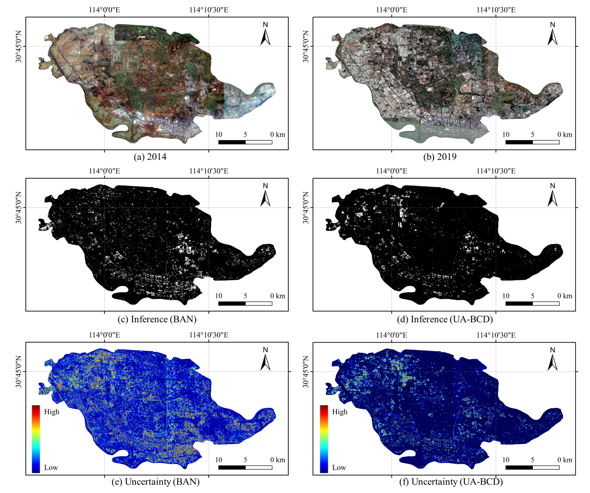

# UA-BCD
The official implement of 《Overcome the Uncertainty Challenges in Detecting Building Changes from Remote Sensing Images》

## Large-scale Application

## Performance Comparison with Baseline Models

## LEVIR-CD Dataset

$\uparrow$ indicates the higher score the better and vice versa. The best score for each metric is marked in **bold**. The second score for each metric is _underlined_.

| Baseline       | IoU $\uparrow$ | F1 $\uparrow$ | Pre $\uparrow$ | Recall $\uparrow$ |
|----------------|----------------|---------------|----------------|-------------------|
| FC-Siam-conc   | 82.24          | 90.25         | 89.67          | 90.84             |
| FC-Siam-diff   | 82.24          | 90.26         | 90.40          | 90.11             |
| SNUNet         | 82.65          | 90.50         | 90.46          | 90.54             |
| BIT            | 82.76          | 90.56         | 90.87          | 90.26             |
| ChangeFormer   | 81.25          | 89.65         | 89.70          | 89.61             |
| P2V-CD         | 83.67          | 91.11         | 91.01          | _91.21_           |
| HANet          | 82.27          | 90.28         | 91.21          | 89.36             |
| CGNet          | _85.21_        | _92.01_       | _93.15_        | 90.90             |
| M-Swin         | 83.58          | 91.05         | 92.08          | 90.05             |
| BAN            | 84.93          | 91.85         | 92.93          | 90.89             |
| **UA-BCD**     | **85.99**      | **92.47**     | **93.38**      | **91.57**         |

## SYSU-CD Dataset

$\uparrow$ indicates the higher score the better and vice versa. The best score for each metric is marked in **bold**. The second score for each metric is _underlined_.

| Baseline       | IoU $\uparrow$ | F1 $\uparrow$ | Pre $\uparrow$ | Recall $\uparrow$ |
|----------------|----------------|---------------|----------------|-------------------|
| FC-Siam-conc   | 66.16          | 79.64         | 83.27          | 76.31             |
| FC-Siam-diff   | 66.93          | 80.19         | 79.96          | **80.42**         |
| SNUNet         | 64.79          | 78.63         | 80.88          | 76.50             |
| BIT            | 65.33          | 79.03         | 78.23          | 79.84             |
| ChangeFormer   | 65.24          | 78.97         | 81.21          | 76.84             |
| P2V-CD         | 64.35          | 78.31         | 81.93          | 74.99             |
| HANet          | 63.14          | 77.41         | 78.71          | 76.14             |
| CGNet          | 66.55          | 79.92         | 86.37          | 74.37             |
| M-Swin         | 66.44          | 79.90         | 87.46          | 73.55             |
| BAN            | _67.35_        | _80.49_       | **88.26**      | 73.97             |
| **UA-BCD**     | **71.38**      | **83.30**     | _87.28_        | _79.66_           |

## Lebedev Dataset

| Baseline       | IoU $\uparrow$ | F1 $\uparrow$ | Pre $\uparrow$ | Recall $\uparrow$ |
|----------------|----------------|---------------|----------------|-------------------|
| FC-Siam-conc   | 84.28          | 91.47         | 88.72          | 94.40             |
| FC-Siam-diff   | 85.94          | 92.44         | 89.99          | 95.02             |
| SNUNet         | 90.65          | 95.10         | 91.55          | _98.93_           |
| BIT            | 89.19          | 94.29         | 91.14          | 97.66             |
| ChangeFormer   | 89.58          | 94.50         | 90.93          | 98.37             |
| P2V-CD         | 91.14          | 95.36         | 91.51          | **99.56**         |
| HANet          | 77.51          | 87.33         | 92.33          | 82.85             |
| CGNet          | _91.41_        | _95.51_       | _96.16_        | 94.48             |
| M-Swin         | 91.84          | 95.75         | 96.12          | 95.38             |
| BAN            | 88.47          | 93.88         | 94.54          | 93.23             |
| **UA-BCD**     | **93.49**      | **96.64**     | **96.38**      | 96.90             |

## WHU-CD Dataset

| Baseline       | IoU $\uparrow$ | F1 $\uparrow$ | Pre $\uparrow$ | Recall $\uparrow$ |
|----------------|----------------|---------------|----------------|-------------------|
| FC-Siam-conc   | 40.89          | 58.05         | 76.49          | 46.77             |
| FC-Siam-diff   | 47.05          | 63.99         | 72.06          | 57.55             |
| SNUNet         | 78.19          | 87.76         | 87.84          | 87.68             |
| BIT            | 68.02          | 80.97         | 74.01          | 89.37             |
| ChangeFormer   | 77.27          | 87.16         | 92.70          | 82.28             |
| P2V-CD         | 78.03          | 87.66         | 86.99          | 88.33             |
| HANet          | 78.82          | 88.16         | 88.30          | 88.01             |
| CGNet          | _86.21_        | _92.59_       | _94.47_        | 90.79             |
| M-Swin         | 80.85          | 89.41         | 90.39          | 88.45             |
| BAN            | 86.05          | 92.57         | 94.03          | _91.15_           |
| **UA-BCD**     | **86.87**      | **92.98**     | **94.71**      | **91.30**         |

## Google-CD Dataset

| Baseline       | IoU $\uparrow$ | F1 $\uparrow$ | Pre $\uparrow$ | Recall $\uparrow$ |
|----------------|----------------|---------------|----------------|-------------------|
| FC-Siam-conc   | 71.12          | 83.13         | 79.86          | 86.67             |
| FC-Siam-diff   | 71.52          | 83.40         | 82.72          | 84.08             |
| SNUNet         | 72.97          | 84.37         | 83.65          | 85.11             |
| BIT            | 75.73          | 86.19         | 86.57          | 85.81             |
| ChangeFormer   | 71.90          | 83.65         | 85.18          | 82.18             |
| P2V-CD         | 74.04          | 85.08         | 87.12          | 83.14             |
| HANet          | 73.14          | 84.49         | 86.03          | 83.00             |
| CGNet          | 75.27          | 85.89         | 88.07          | 83.82             |
| M-Swin         | 76.12          | 86.22         | 88.17          | 84.35             |
| BAN            | _78.70_        | _88.11_       | _89.22_        | _87.02_           |
| **UA-BCD**     | **79.86**      | **88.81**     | **89.66**      | **87.97**        
